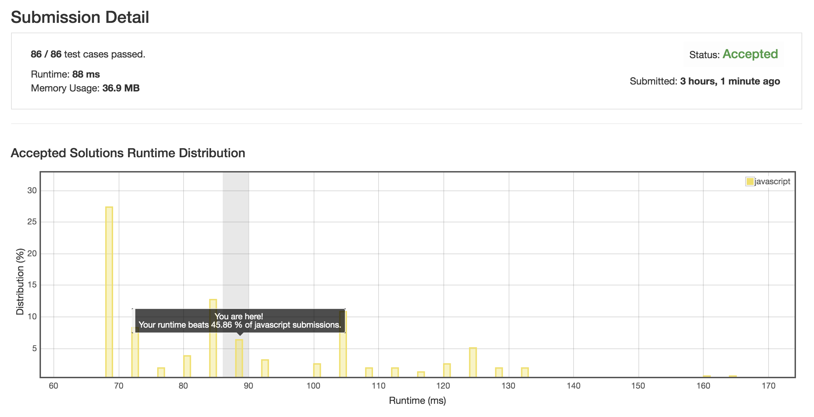

Continuous Subarray Sum
=======
Rule 規則
------

Given a list of non-negative numbers and a target integer k, write a function to check if the array has a continuous subarray of size at least 2 that sums up to the multiple of k, that is, sums up to n*k where n is also an integer.

給予一個數字陣列及一個目標數字，判斷該數字陣列中的任意連續數字總和是否能為目標數字給整除。

***

Example 例子
------

Example 1:
```
Input: [23, 2, 4, 6, 7],  k = 6,
Output: True
```

Example 2:
```
Input: [23, 2, 6, 4, 7],  k = 6,
Output: True
```

***

Origin 來源
-----
[https://leetcode.com/problems/continuous-subarray-sum/](https://leetcode.com/problems/continuous-subarray-sum/)

***

Result 運行結果
-----
